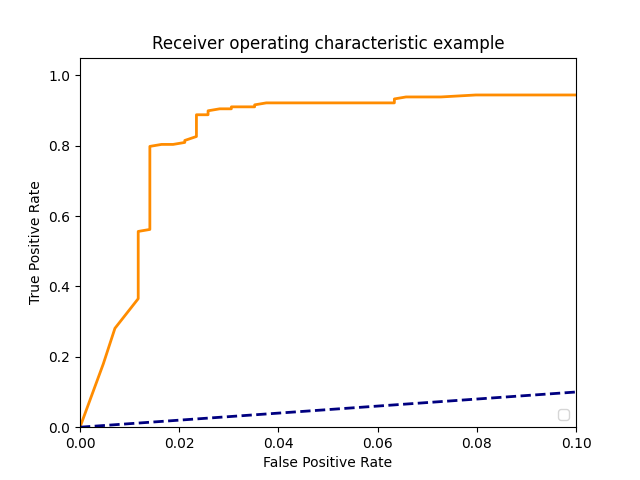
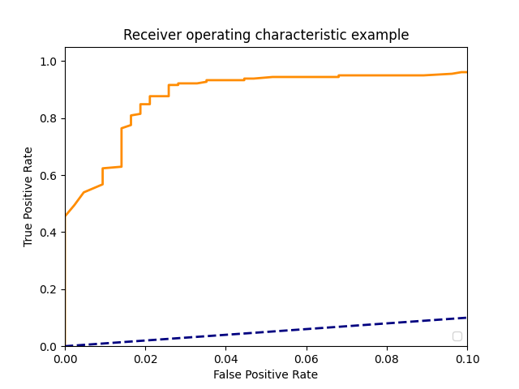

# Duplicate Detector Model

This project contains two scripts: [generate.py]() and [train.py](). The first script generates the feature used by the model from trespassing data. The second script trains a random forest to predict if a given trespassing incident is a duplicate.   

## Data and Feature Generation - generate.py

###Required Packages:
 - csv
 - opencv
 - numpy
 - scikit-image
 - scikit-learn
 - ast

The feature generation script takes the name of the dataset as a parameter. The dataset must be in **csv** format. A csv file with the Thomasville North trespassing data is included. After installing the required packages and adding a csv file to this directory the script can be run with the command below:
```bash
python generate.py "Thomasville N.csv"
```
This script will most likely take a couple of hours to generate the features.

The following features will be generated in a new csv file:

#### Trajectory difference:
There are 4 features that model the difference between two events trajectories. First, the summed difference of trajectory points between the 2 events. Second, The log of the summed difference. Third, the difference between the events first trajectory points. Fourth, the log of the start difference.   
#### Time:
The seconds elapsed between the two events is the only feature in this category.
#### Linear Trajectory:
The trajectories of both events are modeled using linear regression. The coefficients and intercepts are used as features.
#### Previous Duplicates:
Since duplicates are likely to happen consecutively the model takes to features to model past duplicates. First, a boolean value representing whether the last event was a duplicate. Second, an integer value representing the current number of consecutive duplicates. 
#### SSIM score:
The Structural Similarity index between the last frame of the first event's video and the first frame of the suspected duplicate's video.

## Model Training - train.py
###Required Packages:
 - csv
 - opencv
 - numpy
 - pandas
 - scikit-image
 - scikit-learn
 - matplotlib

A csv file name "data.csv" must be included in the directory.

This script only trains a model for testing purposes.
 
Training the model is very straight forward. Simply run the command below:
```bash
python train.py
```

An ROC curve and accuracy metrics will be displayed once the model has been trained. 

##Selecting a Model
Some models perform much better than others. Accuracy is 
not helpful for selecting a model in this situation since
false positives are much worse than false negatives. 
Therefore, the ROC curve needs to be used to select a 
model. Two example ROC curves are shown below. 
Both curves are from models with the same architecture 
and data, but example 2 is a much more useful model. 
Example 2 is more useful because it has a threshold 
that has almost no false positives while still catching 
almost 50% of the duplicates.
###Example 1:

###Example 2:


##Planned 
 - Optimize hyperparameters.
 - Finish checking Thomasville North dataset for unlabeled duplicates (many still exist).
 - Test new model architectures.
 - Test model with uncertain previous duplicate features.
 - Add additional SSIM features.
 - Add trajectory direction feature. 


